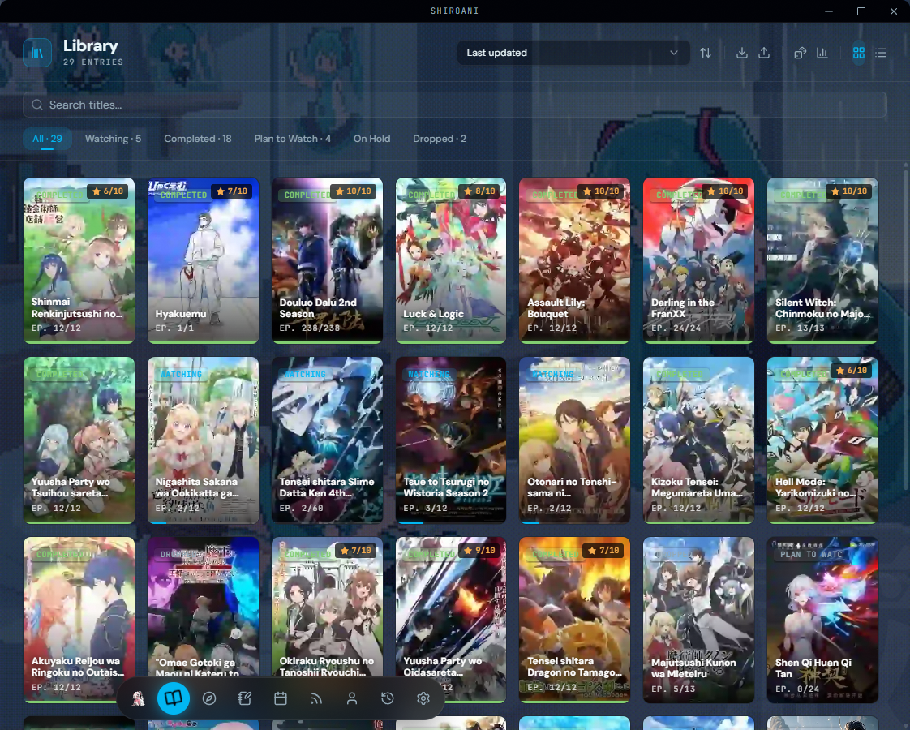
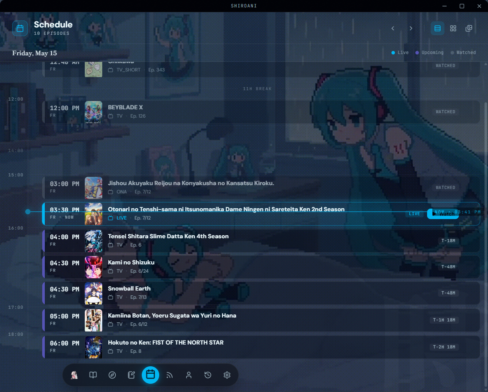
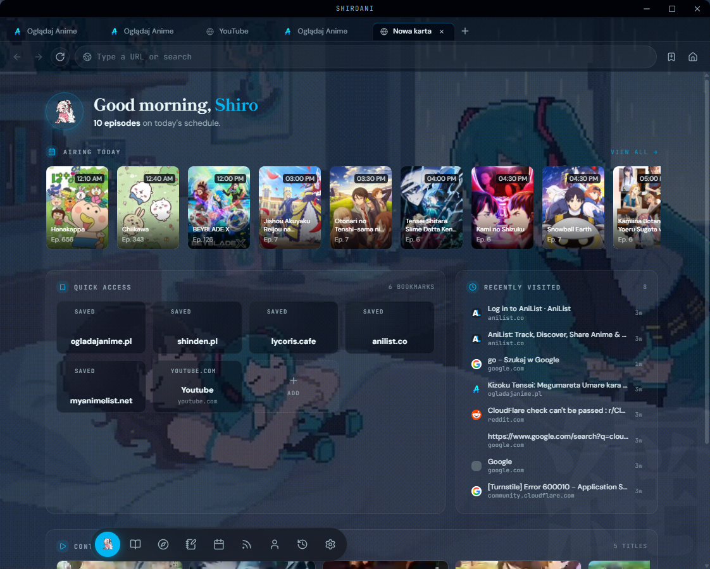
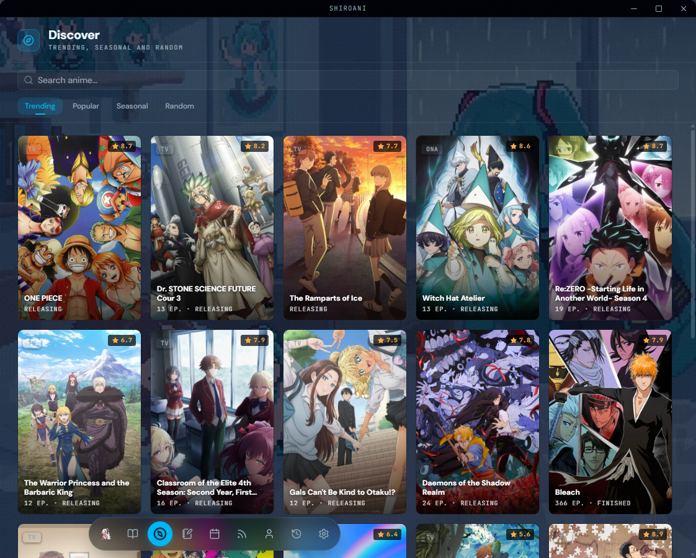
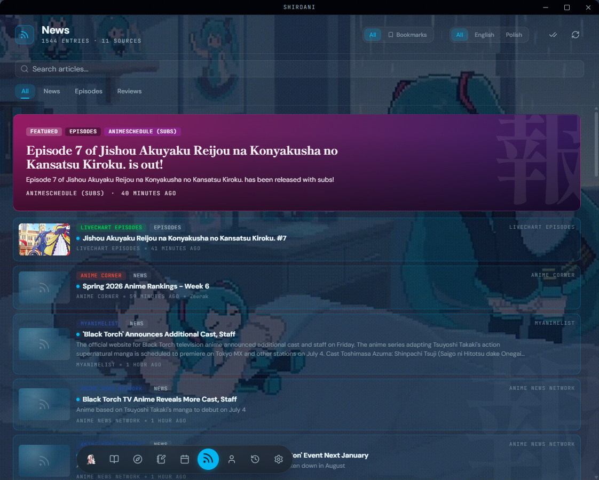
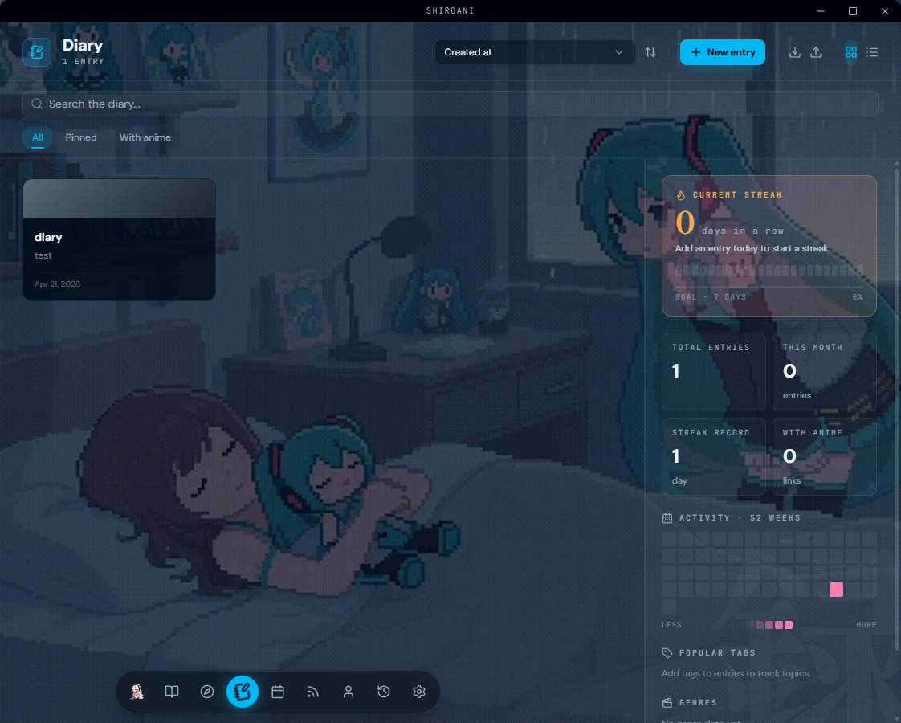
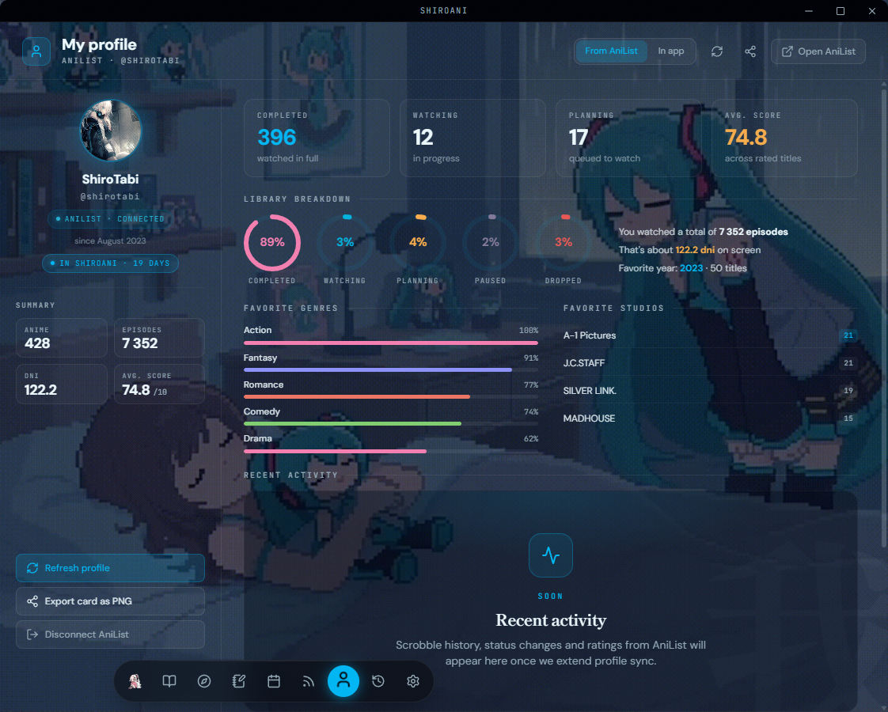
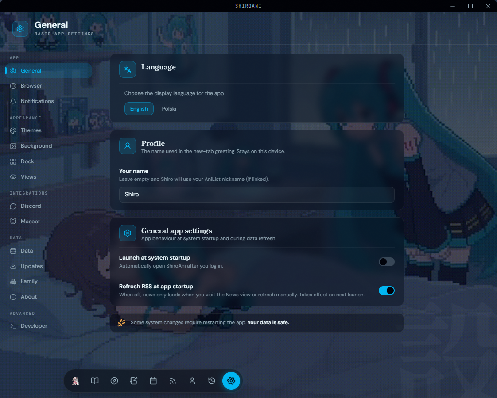

<a name="top"></a>

<div align="center">
  

  <h1>白アニ &nbsp;·&nbsp; ShiroAni</h1>

  <p><strong>Your cozy little corner for all things anime.</strong></p>

  <p>
    <a href="https://github.com/Shironex/shiroani/releases/latest">
      
    </a>
    <a href="https://github.com/Shironex/shiroani/releases">
      
    </a>
    
    <a href="LICENSE">
      
    </a>
  </p>

  <p>
    <a href="https://github.com/Shironex/shiroani/releases/latest"><strong>Download</strong></a>
    &nbsp;·&nbsp;
    <a href="README.pl.md">Polski</a>
  </p>

  <blockquote>
    <p>Shiro-chan is still growing up! The app is in early development — some things might be rough around the edges, but new stuff lands with every release.</p>
  </blockquote>
</div>

---

## What is ShiroAni?

ShiroAni is a desktop app that brings everything anime into one place — browse and watch with a built-in ad-free browser, track what you're watching, catch airing schedules, write in your diary, and hang out with a chibi companion on your desktop. All wrapped in a cozy, themeable UI that feels like home.

## Screenshots

<table>
  <tr>
    <td width="50%"></td>
    <td width="50%"></td>
  </tr>
  <tr>
    <td align="center"><sub>Library — watching, completed, plan-to-watch, on-hold, dropped.</sub></td>
    <td align="center"><sub>Schedule — weekly, daily, and timetable views from AniList.</sub></td>
  </tr>
  <tr>
    <td width="50%"></td>
    <td width="50%"></td>
  </tr>
  <tr>
    <td align="center"><sub>Browser — ad-free new tab with curated sites.</sub></td>
    <td align="center"><sub>Discover — random anime roulette and genre browser.</sub></td>
  </tr>
  <tr>
    <td width="50%"></td>
    <td width="50%"></td>
  </tr>
  <tr>
    <td align="center"><sub>News — bookmarkable RSS feed across EN + PL sources.</sub></td>
    <td align="center"><sub>Diary — a personal journal with a rich text editor.</sub></td>
  </tr>
  <tr>
    <td width="50%"></td>
    <td width="50%"></td>
  </tr>
  <tr>
    <td align="center"><sub>Profile — your AniList stats and recent activity.</sub></td>
    <td align="center"><sub>Settings — themes, backgrounds, dock, language.</sub></td>
  </tr>
</table>

## What's inside

|                           |                                                                                   |
| ------------------------- | --------------------------------------------------------------------------------- |
| **Built-in Browser**      | Watch anime without ads — powered by Ghostery's ad-blocker                        |
| **Your Anime Library**    | Track everything: watching, completed, plan to watch, on hold, dropped            |
| **Airing Schedule**       | Never miss an episode — weekly, daily, and timetable views from AniList           |
| **News Feed**             | Bookmarkable RSS feed of anime news and episode drops (EN + PL sources)           |
| **Discover**              | Random anime roulette and genre browser powered by AniList                        |
| **Diary**                 | A personal journal with a rich text editor, just for you                          |
| **Desktop Mascot**        | A chibi companion who lives on your desktop — swap in your own sprite if you like |
| **17 Themes**             | 15 dark + 2 light, plus a visual editor for unlimited custom themes               |
| **Discord Rich Presence** | Show your friends what you're watching with customizable templates                |
| **Bilingual UI**          | English + Polish, auto-detected from your OS locale                               |

## Getting started

Grab the latest version for your system from [Releases](https://github.com/Shironex/shiroani/releases/latest).

### Windows

1. Download the `.exe` installer.
2. Run it — Windows might show a SmartScreen warning since the app isn't code-signed. Click **"More info"** then **"Run anyway"**.
3. That's it! Future updates install automatically.

### macOS

1. Download the `.dmg` file.
2. Open it and drag ShiroAni to your Applications folder.
3. macOS will block it because it's not code-signed. Open Terminal and run:
   ```bash
   xattr -cr /Applications/ShiroAni.app
   ```
4. Auto-updates aren't available on macOS yet, so grab new versions manually from [Releases](https://github.com/Shironex/shiroani/releases).

## Building from source

Want to hack on ShiroAni or build it yourself? See [CONTRIBUTING.md](CONTRIBUTING.md).

## License

This project is source-available — see the [LICENSE](LICENSE) file for details. You're free to use the app and explore the code, but redistribution, reselling, and derivative works are not permitted.

---

<p align="center">
  Made with &#10084; by <a href="https://github.com/Shironex">Shironex</a>
</p>

[Back to top](#top)
