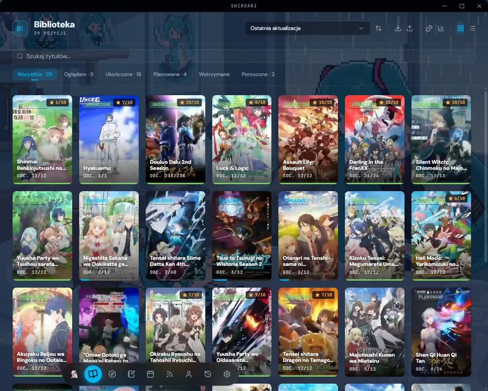
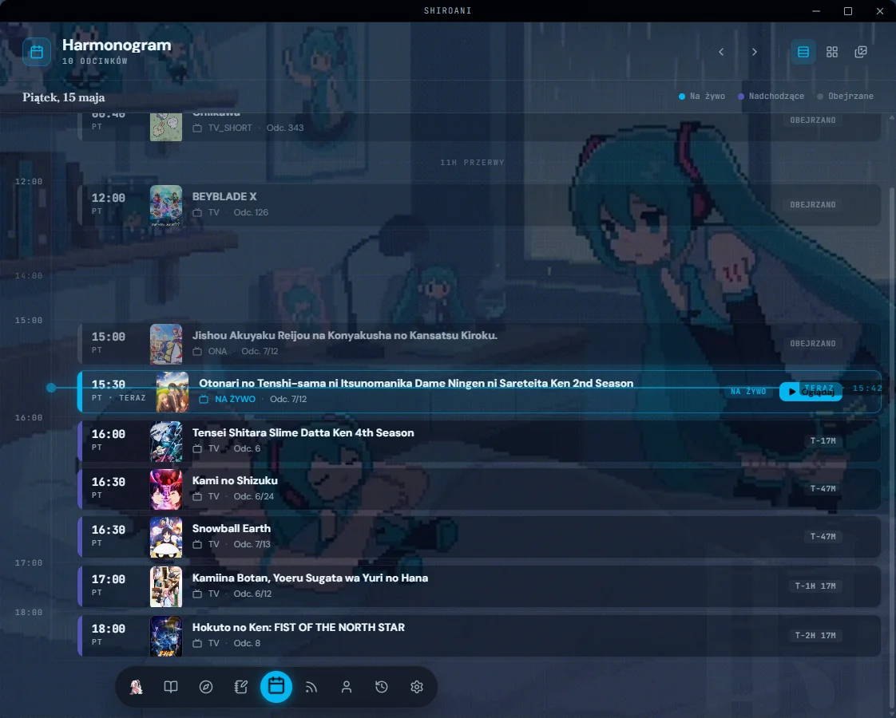
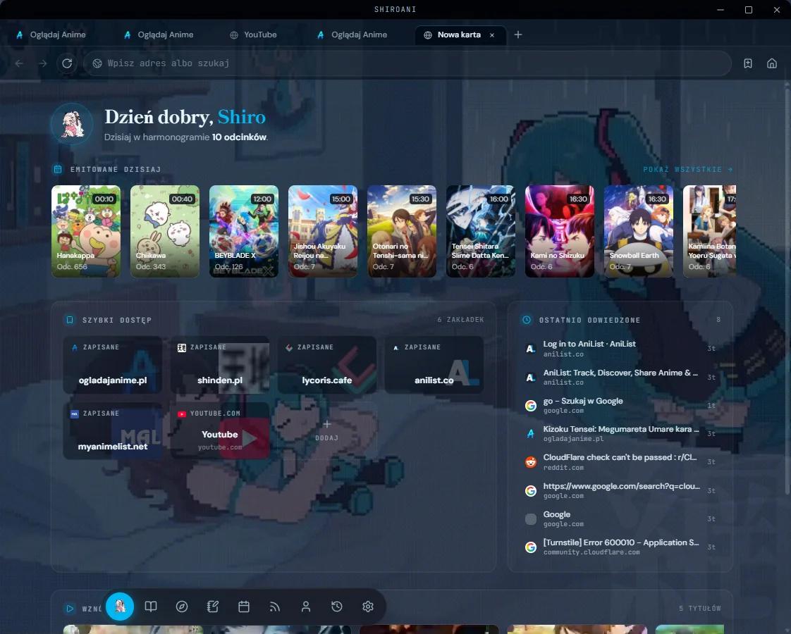
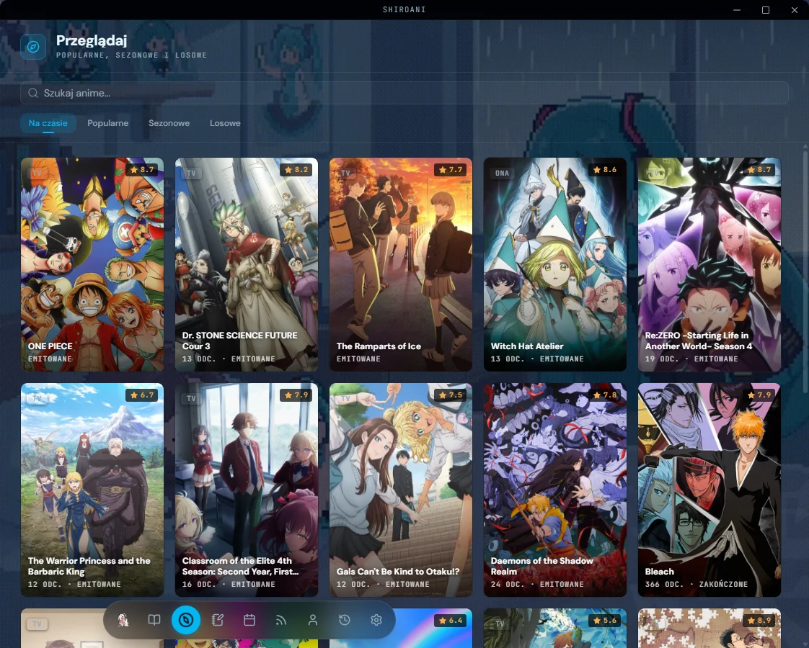
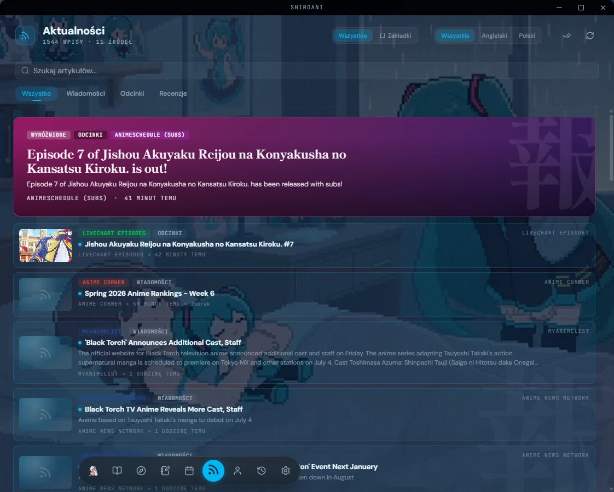
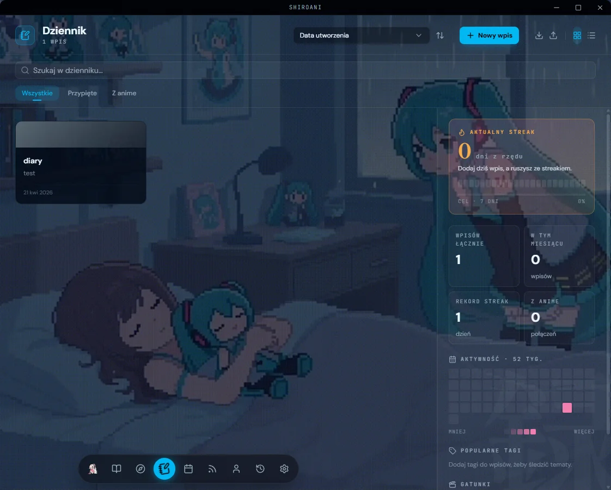
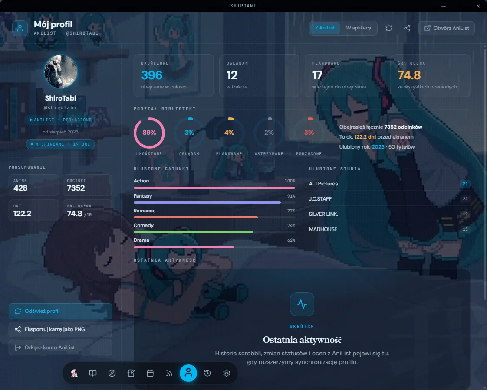
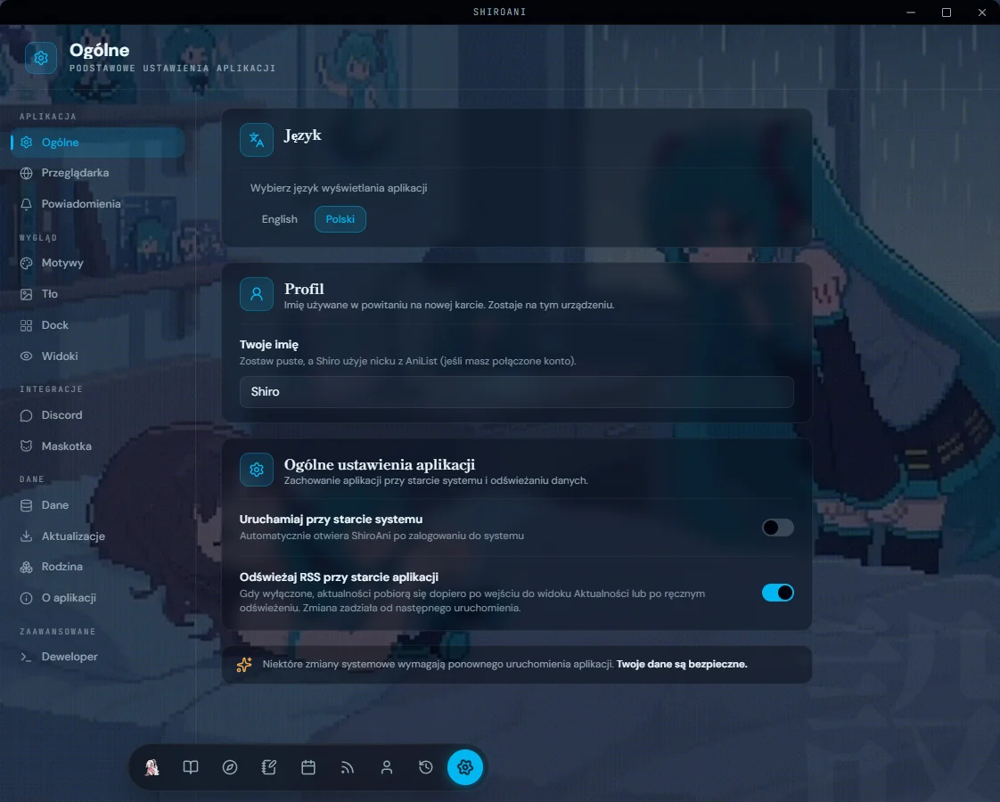

<a name="top"></a>

<div align="center">
  

  <h1>白アニ &nbsp;·&nbsp; ShiroAni</h1>

  <p><strong>Twój przytulny kącik dla wszystkiego, co anime.</strong></p>

  <p>
    <a href="https://github.com/Shironex/shiroani/releases/latest">
      
    </a>
    <a href="https://github.com/Shironex/shiroani/releases">
      
    </a>
    
    <a href="LICENSE">
      
    </a>
  </p>

  <p>
    <a href="https://github.com/Shironex/shiroani/releases/latest"><strong>Pobierz</strong></a>
    &nbsp;·&nbsp;
    <a href="https://shiroani.app"><strong>Strona</strong></a>
    &nbsp;·&nbsp;
    <a href="https://shiroani.app/changelog"><strong>Changelog</strong></a>
    &nbsp;·&nbsp;
    <a href="README.md">English</a>
  </p>

  <blockquote>
    <p>Shiro-chan dorosła — ShiroAni 1.0 jest stabilna, dopracowana i bezpłatna. Witaj w domu.</p>
  </blockquote>
</div>

---

## Czym jest ShiroAni?

ShiroAni to aplikacja desktopowa, która zbiera wszystko co anime w jednym miejscu — przeglądaj i oglądaj z wbudowaną przeglądarką bez reklam, śledź co oglądasz, sprawdzaj harmonogramy emisji, pisz w pamiętniku i spędzaj czas z chibi towarzyszką na pulpicie. Wszystko w przytulnym, konfigurowalnym interfejsie, który czuje się jak dom.

## Zrzuty ekranu

<table>
  <tr>
    <td width="50%"></td>
    <td width="50%"></td>
  </tr>
  <tr>
    <td align="center"><sub>Biblioteka — oglądane, ukończone, planowane, wstrzymane, porzucone.</sub></td>
    <td align="center"><sub>Harmonogram — widok tygodniowy, dzienny i tabelaryczny z AniList.</sub></td>
  </tr>
  <tr>
    <td width="50%"></td>
    <td width="50%"></td>
  </tr>
  <tr>
    <td align="center"><sub>Przeglądarka — nowa karta bez reklam z wybranymi serwisami.</sub></td>
    <td align="center"><sub>Odkrywaj — losowanie anime i przegląd po gatunkach.</sub></td>
  </tr>
  <tr>
    <td width="50%"></td>
    <td width="50%"></td>
  </tr>
  <tr>
    <td align="center"><sub>Aktualności — RSS z anime newsami, źródła PL + EN.</sub></td>
    <td align="center"><sub>Pamiętnik — osobisty dziennik z edytorem tekstu.</sub></td>
  </tr>
  <tr>
    <td width="50%"></td>
    <td width="50%"></td>
  </tr>
  <tr>
    <td align="center"><sub>Profil — Twoje statystyki AniList i ostatnia aktywność.</sub></td>
    <td align="center"><sub>Ustawienia — motywy, tła, dock, język.</sub></td>
  </tr>
</table>

## Co znajdziesz w środku

|                                  |                                                                                                                        |
| -------------------------------- | ---------------------------------------------------------------------------------------------------------------------- |
| **Wbudowana przeglądarka**       | Oglądaj anime bez reklam — blokowanie przez Ghostery; automatycznie wykrywa obejrzane odcinki i aktualizuje bibliotekę |
| **Biblioteka anime**             | Śledź wszystko: oglądane, ukończone, planowane, wstrzymane, porzucone                                                  |
| **Harmonogram emisji**           | Nigdy nie przegap odcinka — widok tygodniowy, dzienny i tabelaryczny z AniList                                         |
| **Aktualności**                  | RSS z wiadomościami anime i premierami odcinków, z zakładkami (źródła PL + EN)                                         |
| **Odkrywaj**                     | Losowanie anime i przegląd po gatunkach napędzany przez AniList                                                        |
| **Pamiętnik**                    | Osobisty dziennik z edytorem tekstu, tylko dla Ciebie                                                                  |
| **Maskotka na pulpicie**         | Chibi towarzyszka na pulpicie — możesz podmienić ją na własną grafikę                                                  |
| **17 motywów**                   | 15 ciemnych + 2 jasne, plus wizualny edytor do tworzenia własnych                                                      |
| **Synchronizacja AniList i MAL** | Dwukierunkowa synchronizacja z AniList i MyAnimeList — push, pull lub oba (eksperymentalne)                            |
| **Discord Rich Presence**        | Pokaż znajomym, co oglądasz, z konfigurowalnymi szablonami                                                             |
| **Dwujęzyczny interfejs**        | Polski i angielski, wykrywany automatycznie z ustawień systemu                                                         |

## Jak zacząć

Pobierz najnowszą wersję ze strony [Releases](https://github.com/Shironex/shiroani/releases/latest).

### Windows

1. Pobierz instalator `.exe`.
2. Uruchom go — Windows może pokazać ostrzeżenie SmartScreen, bo aplikacja nie ma podpisu cyfrowego. Kliknij **"Więcej informacji"**, potem **"Uruchom mimo to"**.
3. Gotowe! Przyszłe aktualizacje zainstalują się same.

### macOS

1. Pobierz plik `.dmg`.
2. Otwórz go i przeciągnij ShiroAni do folderu Aplikacje.
3. macOS zablokuje aplikację, bo nie ma podpisu cyfrowego. Otwórz Terminal i wpisz:
   ```bash
   xattr -rd com.apple.quarantine /Applications/ShiroAni.app
   ```
   To jednorazowy krok, który usuwa wyłącznie flagę kwarantanny macOS — aplikacja nie jest jeszcze notaryzowana, ale nic więcej nie jest zmieniane.
4. Automatyczne aktualizacje na macOS nie są jeszcze dostępne — nowe wersje pobieraj ręcznie z [Releases](https://github.com/Shironex/shiroani/releases).

## Budowanie ze źródeł

Chcesz pogrzebać w ShiroAni albo zbudować aplikację samodzielnie? Zajrzyj do [CONTRIBUTING.md](CONTRIBUTING.md).

## Licencja

Ten projekt jest udostępniony jako source-available — szczegóły w pliku [LICENSE](LICENSE). Możesz swobodnie korzystać z aplikacji i przeglądać kod, ale redystrybucja, odsprzedaż i tworzenie prac pochodnych są zabronione.

---

<p align="center">
  Zrobione z &#10084; przez <a href="https://github.com/Shironex">Shironex</a>
</p>

[Wróć na górę](#top)
